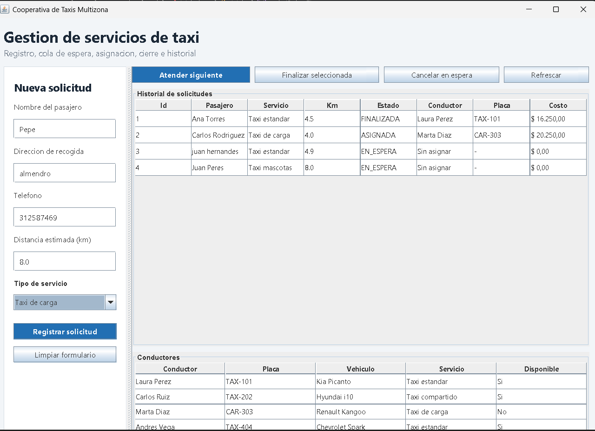
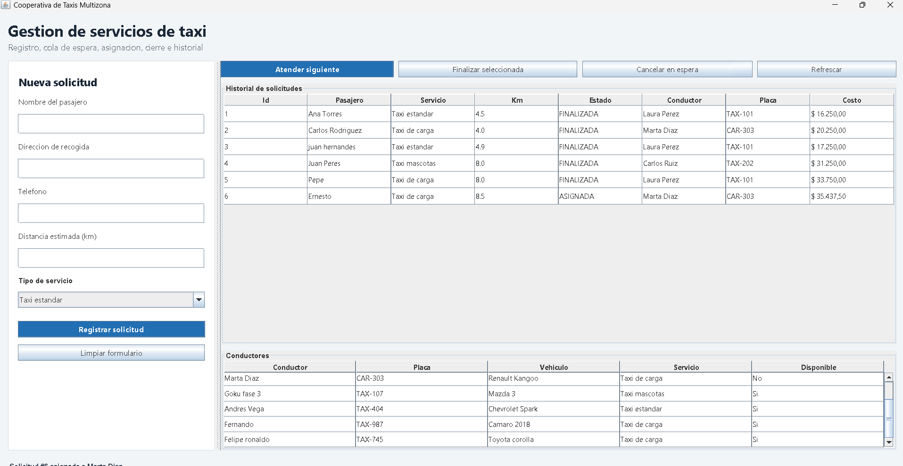

# Sistema de Gestion de Servicios para una Cooperativa de Taxis

Proyecto final de Programacion Orientada a Objetos.

## Funcionalidades

- Recepcion de solicitudes con nombre, direccion, telefono, tipo de servicio y distancia.
- Cola de solicitudes en espera.
- Asignacion automatica de conductor disponible segun el tipo de servicio.
- Calculo de tarifa con base minima de $5.000 COP y costo por kilometro.
- Cierre, cancelacion e historial de solicitudes.
- Persistencia en archivo CSV: `data/historial_solicitudes.csv`.
- Carga inicial del historial guardado al abrir nuevamente el programa.
- Manejo de excepciones personalizadas.
- Interfaz grafica con Swing/JFrame.

## Tipos de servicio

- Taxi estandar.
- Taxi mascotas.
- Taxi de carga.

## Patron de diseno aplicado

Se aplican dos patrones:

- **Factory Method / Simple Factory**: `ServicioTaxiFactory` centraliza la creacion de `ServicioEstandar`, `ServicioCompartido` y `ServicioCarga`. Esto evita condicionales repetidos y permite agregar nuevos tipos de servicio sin alterar el resto del sistema.
- **Strategy**: `TarifaStrategy` permite cambiar la forma de calcular tarifas sin modificar el gestor de solicitudes. La implementacion actual es `TarifaEstandarStrategy`.

## Principios de POO

- **Abstraccion**: `ServicioTaxi` representa el comportamiento comun de los servicios.
- **Herencia**: `ServicioEstandar`, `ServicioCompartido` y `ServicioCarga` heredan de `ServicioTaxi`.
- **Polimorfismo**: cada servicio define su propio `factorTarifa()` y `descripcion()`.
- **Encapsulamiento**: los atributos del dominio son privados y se accede mediante metodos.
- **SOLID**: el gestor coordina el flujo, el repositorio guarda datos, la estrategia calcula tarifas y la fabrica crea servicios.

## Compilar y ejecutar

Desde la carpeta del proyecto:

```powershell
javac -d out (Get-ChildItem -Recurse -Filter *.java src).FullName
java -cp out com.cooperativa.taxi.Main
```

La ejecucion anterior abre la ventana grafica. Si quieres usar la version por consola:

```powershell
java -cp out com.cooperativa.taxi.Main --console
```

## Estructura

```text
src/com/cooperativa/taxi
|-- app
|-- exception
|-- factory
|-- model
|-- pricing
|-- repository
|-- ui
    |-- swing
```



