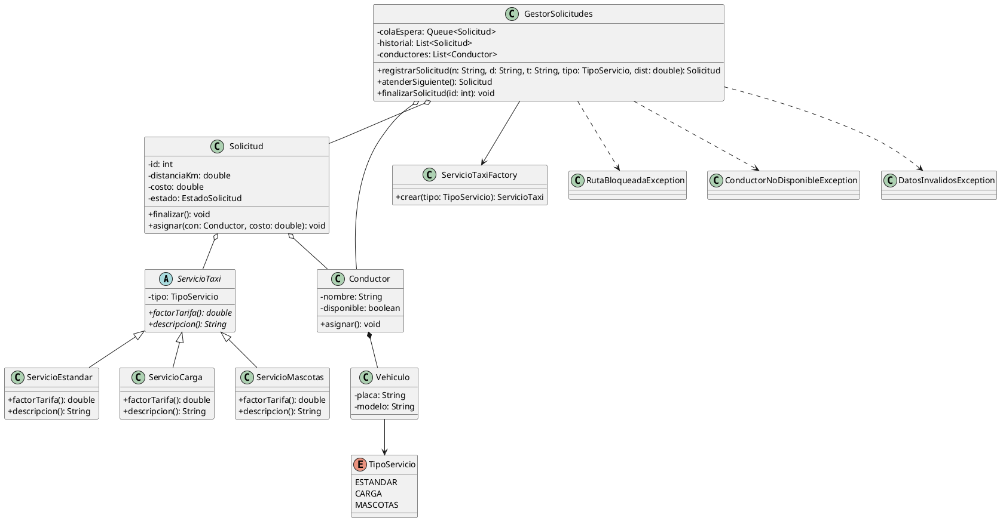

## Sección UML

Diagrama de clases (PlantUML):

Descripción de elementos:

- ServicioTaxi (abstracto): define la interfaz de servicios con factorTarifa() y descripcion().
- ServicioEstandar / ServicioCarga / ServicioMascotas: implementaciones concretas que suministran el factor de tarifa y la descripción.
- Solicitud: representa una petición de servicio; contiene id, distancia, costo y estado; puede asignarse y finalizarse.
- Conductor: entidad con nombre, disponibilidad y método para asignarse a una solicitud.
- Vehiculo: datos básicos del vehículo asociado al conductor.
- GestorSolicitudes: coordina cola de espera, historial y conductores; registra, atiende y finaliza solicitudes.
- ServicioTaxiFactory: fabrica de servicios según TipoServicio.
- Excepciones: RutaBloqueadaException, ConductorNoDisponibleException, DatosInvalidosException para errores del flujo.
- TipoServicio (enum): ESTANDAR, CARGA, MASCOTAS.

Uso sugerido:
- Incluir este bloque PlantUML en la documentación para generar el diagrama.
- Complementar con diagramas de secuencia o de estados según sea necesario.
