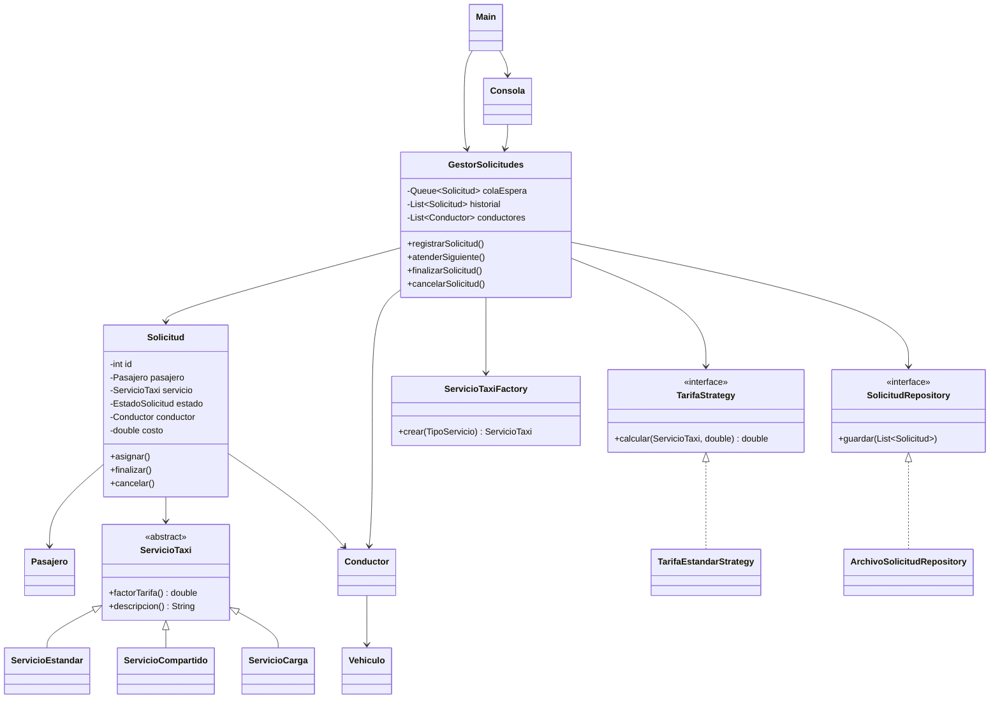
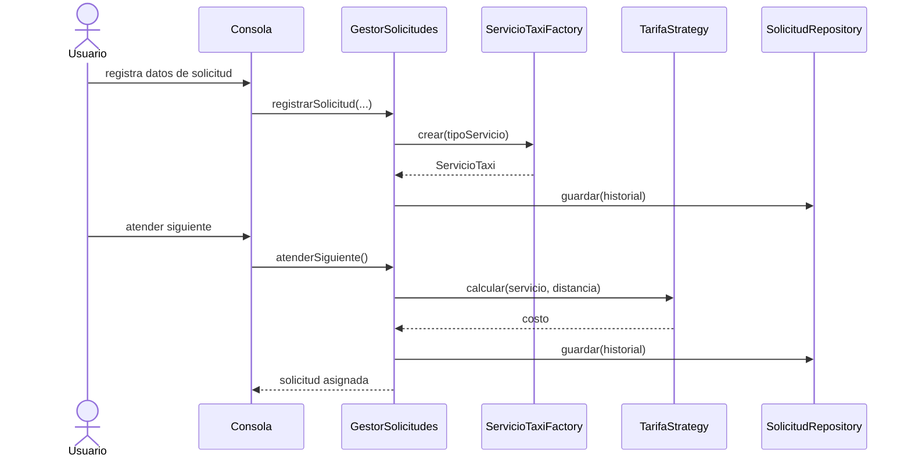

# Diseno UML

## Diagrama de clases

## Diagrama de secuencia: atencion de solicitud

## Casos de uso principales

- Registrar solicitud.
- Consultar solicitudes en espera.
- Atender solicitud y asignar conductor.
- Cancelar solicitud en espera.
- Finalizar servicio.
- Consultar historial.
